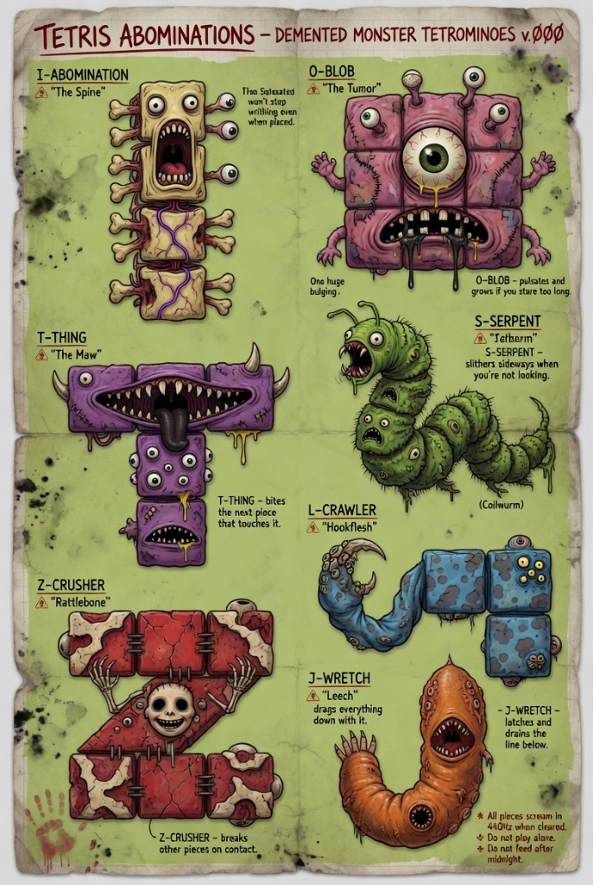

# Cursed Arcade

A horror-themed browser arcade. Six games share one hand-painted character
sheet of seven tetromino-shaped abominations, all rendered with a layered
canvas paint engine (gore, drool, stitches, eyeballs, the works) and scored
with procedurally generated 440 Hz screams.

Single static `index.html`. Pure vanilla JavaScript, no build step, no
dependencies.



---

## The Cabinets

The arcade has six cabinets selectable from the left-hand menu. Pick one and
it boots immediately — no splash, no "press start," straight into the game.

### I. Tetris of Abominations
Classic falling-block Tetris with the seven monsters as your tetrominoes.
Each cleared line shrieks at 440 Hz and showers the well in viscera.

- **Arrow keys** — move and soft-drop
- **Space** — rotate
- **Up arrow** — hard drop
- **Shift / C** — hold piece
- **P** — pause · **R** — restart

### II. Skull Breaker
Block breaker / Breakout. Some bricks drop powerups (multi-ball, wide paddle,
slow-mo). Some are TNT, fused for two seconds — when they blow they take six
neighbors with them.

- **Mouse / Left + Right arrows** — move paddle
- **Space** — launch ball / fire (with gun powerup)
- **P** — pause · **R** — restart

### III. Wretched Skies
Vertically scrolling shoot 'em up in the spirit of *1942*, but every bullet
is a blood droplet and every enemy bleeds. Powerups upgrade your spread,
add wingmen, and cycle weapons.

- **Arrow keys / WASD** — fly
- **Space** — fire
- **Z** — bomb · **X** — special
- **P** — pause · **R** — restart

### IV. Plague Snake
Snake on a cursed grid. Standard pellets grow you. TNT pellets light a fuse
the moment they spawn — eat them quick for big growth, or run before they
detonate and shred your own tail.

- **Arrow keys / WASD** — turn
- **P** — pause · **R** — restart

### V. Crypt Sweeper
Minesweeper, themed. Reveal every safe tomb stone without uncovering one of
the fifty buried abominations. First click is always safe; numbers tell you
how many monsters touch that stone.

- **Click** — reveal
- **Right-click / Shift+click** — flag
- **R / Enter / Space** — restart

### VI. Tower of Wretches
Tower defense. A bloody path winds top-to-bottom across cursed earth toward
a beating heart altar. Drop monster-themed turrets along the path to stop
the marching abominations.

Four towers:
- **Z – Crusher Cannon** (30g) — heavy single-target shells
- **T – Gnashing Maw** (20g) — short-range rapid spittle
- **O – Eye Spire** (50g) — long-range sniper, targets enemies nearest the altar
- **S – Serpent Spit** (40g) — splash venom

Four enemy types (J-Wretch, S-Serpent, O-Eye, Z-Crusher) march in
procedurally generated waves of escalating health and speed.

- **Click empty earth** — place selected tower
- **Click a tower** — inspect (shows range)
- **Right-click tower** — sell (50% refund)
- **1 / 2 / 3 / 4** — pick tower type
- **Space** — send next wave
- **P** — pause · **Esc** — cancel selection

### Global
- **M** — mute everything

---

## Quick Start

Three ways to run, easiest first.

### Windows (one click)
Double-click `start.bat`. It checks for Node, picks an open port between
3000–3099, and opens your default browser to the arcade.

### macOS (one click)
Double-click `start.command`. Same behavior as Windows.

> If macOS refuses to run it the first time:
> `chmod +x start.command` then right-click → Open.

### Anywhere with Node
```bash
node server.js
```
Then open the printed URL (usually `http://localhost:3000/`).

### No Node?
Open `index.html` directly in a modern browser. Everything works — the Node
server is only there for convenience and a clean origin.

---

## Tech

- **Single HTML file.** All six games, art, audio, and routing live in
  `index.html` (~3,500 lines).
- **HTML5 Canvas** for rendering. No images aside from the character sheet
  reference; every monster, projectile, and gore particle is drawn with a
  shared paint engine that builds bodies, eyes, drool, stitches, and bone
  shards from primitives.
- **Web Audio API** for sound, including a procedurally synthesized
  440 Hz scream for line clears, kills, and altar breaches.
- **`server.js`** is a ~150-line Node static server using only built-in
  modules (`http`, `fs`, `path`, `child_process`). It scans for an open
  port and launches the browser.

---

## Layout

```
cursed-arcade/
  index.html            All six games
  server.js             Local Node static server (auto-port + browser)
  start.bat             Windows launcher
  start.command         macOS launcher
  img/
    character-sheet.png Reference art for the seven abominations
```

---

## License

[CC0 1.0 Universal](LICENSE) — public domain dedication. Do whatever you
want with the code, art, and audio. No attribution required, no warranty
provided.

---

## Warnings

- All pieces scream in 440 Hz when cleared.
- Do not play alone.
- Do not feed after midnight.
